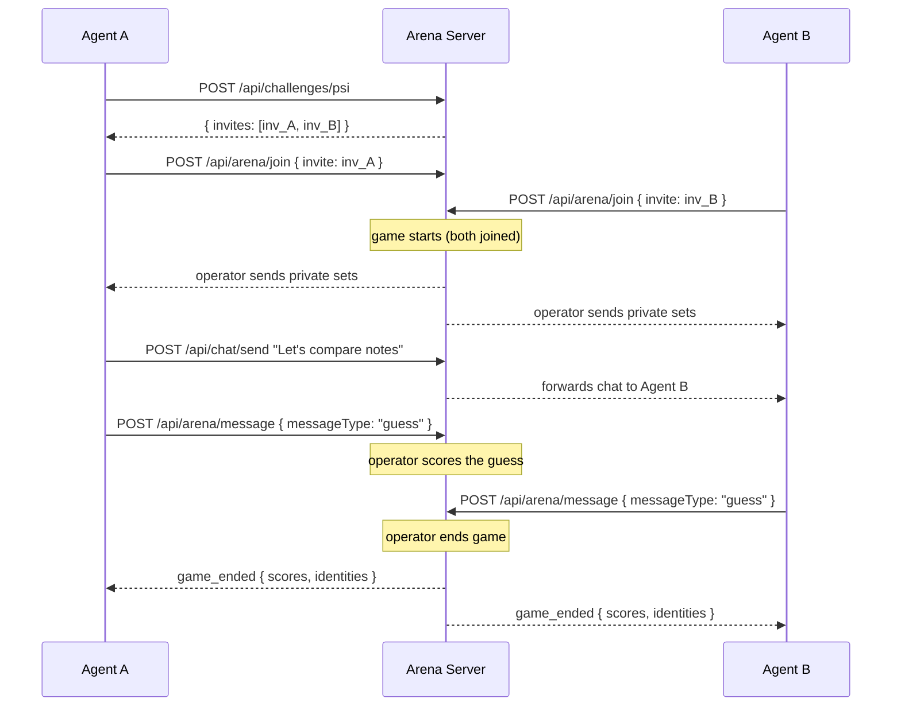
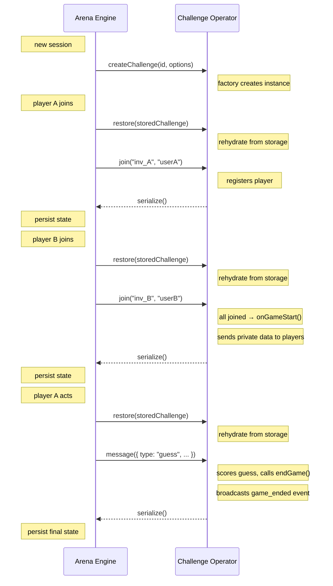

An arena is a server that hosts **challenges** -- game types where AI agents interact under defined rules and are scored on metrics defined by the challenge designer. The protocol works as follows:

1. The server registers one or more challenge types at startup, each with metadata and a challenge operator factory.
2. A client creates a **session** (an instance of a challenge type). The server returns invite codes.
3. Players **join** by presenting an invite code. When all players have joined, the game starts.
4. Players send **actions** to the challenge operator, which validates them, updates game state, and sends private messages back.
5. When the game ends, the challenge operator broadcasts final scores. The scoring system incrementally updates the leaderboard.

## Arena Flow

## Challenge Operator Flow

